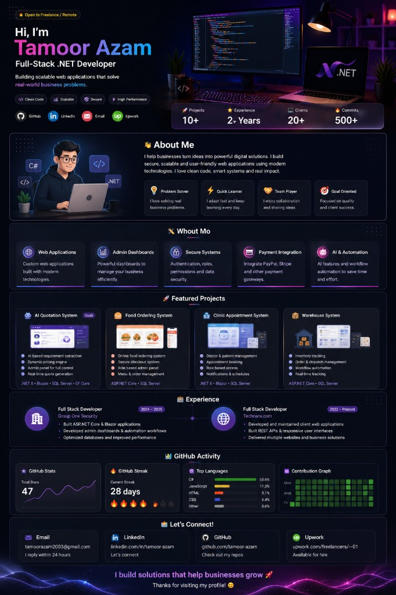

<!-- Tamoor Azam — GitHub profile README (landing-style layout) -->

  

 

  

 

# Tamoor Azam

### FULL-STACK .NET DEVELOPER

Building scalable web applications that solve real-world problems

 

🚀 Clean Code · 🛡️ Secure · 📈 Scalable · ⚡ High Performance

 

 

| Projects | Experience | Clients | Activity |
| :------: | :--------: | :-----: | :------: |
| **10+** | **2+ yrs** | **20+** | **500+ commits** |

<em>Highlights reflect shipped work and ongoing freelance delivery.</em>

 

 

---

## About me

<table>
<tr>
<td width="40%" valign="top" align="center">

</td>
<td width="60%" valign="top">

👋 **About me**

I help businesses turn ideas into **powerful digital solutions**. I build secure, scalable, and user-friendly web applications using modern technologies. I care about clean code, smart systems, and real impact.

| | |
| --- | --- |
| 🎯 **Problem solver** | Turning vague requirements into clear, buildable scope. |
| 💡 **Quick learner** | Adopts new tools when they genuinely improve delivery. |
| 🤝 **Team player** | Works closely with stakeholders and other engineers. |
| 🏁 **Goal oriented** | Ships outcomes, not endless rework. |

</td>
</tr>
</table>

---

## What I do

<table>
<tr>
<td width="20%" valign="top">

**Web applications**  
Custom sites and internal apps aligned with real workflows.

</td>
<td width="20%" valign="top">

**Admin dashboards**  
Operational visibility: approvals, metrics, and day-to-day controls.

</td>
<td width="20%" valign="top">

**Secure systems**  
Authentication, roles, and safeguards matched to your risk profile.

</td>
<td width="20%" valign="top">

**Payment integration**  
Checkout flows wired to trusted providers.

</td>
<td width="20%" valign="top">

**AI & automation**  
Practical assistants and workflows where they remove manual effort.

</td>
</tr>
</table>

---

## Featured projects

  

 

<table>
<tr>
<td width="50%" valign="top">

### 🤖 AI Quotation System `SaaS`

- AI-assisted quoting with **dynamic pricing** and configurable rules.
- **Admin panel** for products, margins, and approvals.
- Designed as a repeatable **subscription-friendly** workflow.

.NET 8 · Blazor · SQL Server

</td>
<td width="50%" valign="top">

### 🍔 Food Ordering System

- **Online ordering** with menus built for busy venues.
- **Secure checkout** and tools staff rely on during service.
- **Admin dashboard** for pricing, catalog, and operations.

ASP.NET Core · SQL Server

</td>
</tr>
<tr>
<td width="50%" valign="top">

### 📅 Clinic Appointment System

- **Appointment booking** for patients and clinicians.
- **Role-based access** across front desk, doctors, and admins.
- Scheduling focused on clarity and fewer conflicts.

.NET · Blazor · SQL Server

</td>
<td width="50%" valign="top">

### 📦 Warehouse System

- **Inventory and dispatch** with traceable movement.
- **Order management** aligned with real fulfilment flows.
- Reporting that supports operations—not fragile spreadsheets.

.NET · SQL Server

</td>
</tr>
</table>

---

## Experience

<table>
<tr>
<td width="30%" valign="top">

**Full Stack Developer**  
**Group One Security** · *2024 — 2025*

</td>
<td width="70%" valign="top">

<ul>
<li>Built secure web applications with understandable permission models.</li>
<li>Delivered admin dashboards that shortened everyday operational tasks.</li>
<li>Improved performance where it impacted real users.</li>
</ul>

</td>
</tr>
<tr><td colspan="2">
</td></tr>
<tr>
<td width="30%" valign="top">

**Full Stack Developer**  
**Technare.com** · *2022 — Present*

</td>
<td width="70%" valign="top">

<ul>
<li>Shipped multiple client sites and supporting internal tools.</li>
<li>Kept APIs and UIs aligned so releases stayed predictable.</li>
<li>Partnered with stakeholders who need clarity, not jargon.</li>
</ul>

</td>
</tr>
</table>

---

## GitHub activity

 

---

## Let's connect

<table>
<tr>
<td align="center" width="25%"><strong>Email</strong> I reply within 24 hours when possible.  <a href="mailto:tamoorazam2003@gmail.com">tamoorazam2003@gmail.com</a></td>
<td align="center" width="25%"><strong>LinkedIn</strong> Professional updates & messages.  <a href="https://www.linkedin.com/in/raja-tamoor-25b842262/">linkedin.com/in/raja-tamoor-25b842262</a></td>
<td align="center" width="25%"><strong>GitHub</strong> Code & open-source activity.  <a href="https://github.com/rajatamoor">github.com/rajatamoor</a></td>
<td align="center" width="25%"><strong>Upwork</strong> Hire for freelance engagements.  <a href="https://www.upwork.com/freelancers/~01b2d75ae98acbda8d?viewMode=1">Upwork profile</a></td>
</tr>
</table>

---

### Let's build something **great** together!

**I build solutions that help businesses grow.**

Thanks for visiting my profile!

 

